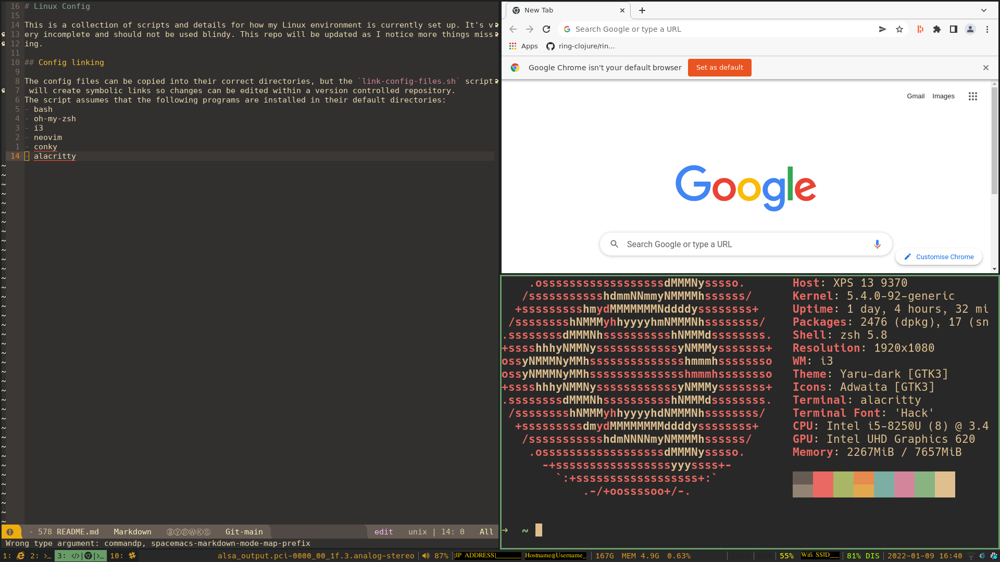

# Linux Config

This is a collection of scripts and details for how my Linux environment is currently set up. It's very incomplete and should not be used blindy. This repo will be updated as I notice more things missing.

## Output

## Config linking

The config files can be copied into their correct directories, but the `link-config-files.sh` script will create symbolic links so changes can be edited within a version controlled repository.
The script assumes that the following programs are installed in their default directories:
- bash
- oh-my-zsh
- i3
- neovim
- conky
- alacritty
